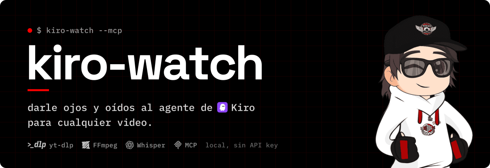

<div align="center">



<br/>

[](https://github.com/sam-wilkie/kiro-watch/releases/latest)
[](LICENSE)
[](https://hits.sh/github.com/sam-wilkie/kiro-watch/)

</div>

Dale **ojos y oídos** al agente de Kiro para cualquier video. Pegás una URL (YouTube, Vimeo, TikTok, X/Twitter, Instagram, Loom y ~1800 sitios más vía [yt-dlp](https://github.com/yt-dlp/yt-dlp)) o un archivo local, y `kiro-watch` baja el video, extrae **fotogramas** como imágenes y **transcribe el audio localmente** con Whisper. Después le entrega a Kiro los frames y la transcripción para que Kiro **vea** los fotogramas con su propia visión multimodal y responda sobre el video.

Todo corre en tu máquina. **Sin API key, sin nube, sin costos.** El modelo que "mira" el video es Kiro mismo.

> [!NOTE]
> **Por qué existe.** Kiro lee imágenes de forma nativa pero no tiene entrada de video. La mayoría de las herramientas de "ver un video" mandan el archivo entero a una API multimodal paga. `kiro-watch` no: es una **capa de percepción**, no de interpretación. Baja, recorta y transcribe en local, y deja que el agente anfitrión haga el resto.

## `$ cat arquitectura.md`

```
video --> [yt-dlp] descarga --> [ffmpeg] frames + audio --> [whisper] transcripción
      --> Kiro lee los frames (su propia visión) + la transcripción --> responde
```

1. **yt-dlp** descarga el video (o se usa el archivo local tal cual).
2. **ffmpeg** extrae fotogramas muestreados como JPEG y, si hay pista de audio, un WAV mono de 16 kHz.
3. **Whisper** transcribe ese audio en local (`mlx-whisper` en Apple Silicon, `openai-whisper` en CPU). El WAV se borra; solo queda el texto.
4. **Kiro** recibe las rutas de los frames y la transcripción, lee las imágenes con su visión y responde sobre el video.

## `$ ./instalar`

```bash
git clone https://github.com/sam-wilkie/kiro-watch.git
cd kiro-watch
python3 scripts/setup.py   # instala ffmpeg, yt-dlp y el motor Whisper correcto
```

**Requisitos**
- **Python 3.9+**
- **ffmpeg** y **yt-dlp** (en macOS los instala el setup vía Homebrew).
- Un motor Whisper local, solo para transcribir:
  - **mlx-whisper** — Apple Silicon, corre en el Neural Engine (preferido en M-series).
  - **openai-whisper** — fallback por CPU (Intel / Linux / Windows).

## `$ ./conectar --kiro`

Registrá el MCP en la config global de Kiro:

```bash
kiro-cli mcp add \
  --name kiro-watch \
  --command python3 \
  --args "$(pwd)/scripts/mcp_server.py" \
  --scope global
```

O agregalo a mano en `~/.kiro/settings/mcp.json` (ver [examples/mcp.json](examples/mcp.json)):

```json
{
  "mcpServers": {
    "kiro-watch": {
      "command": "python3",
      "args": ["/ruta/absoluta/a/kiro-watch/scripts/mcp_server.py"]
    }
  }
}
```

Reiniciá tu sesión de `kiro-cli chat` (o dejá que el hot-reload lo levante) y pedile a Kiro:

> mirá este video y decime qué pasa en el minuto 0:30 — https://youtu.be/dQw4w9WgXcQ

Kiro llama a la herramienta `watch_video`, lee los frames que devuelve y responde.

## `$ ./margarita --preview`

| **Un video de YouTube** | **Un video sin audio** |
| :--- | :--- |
| Baja, muestrea frames y transcribe con Whisper. Kiro ve y escucha. | Degrada con gracia: devuelve los frames y `transcript_source: "none"`, sin romperse. |
| `yt-dlp · ffmpeg · mlx-whisper` | `ffprobe detecta la ausencia de audio` |

| **Fuentes con login** | **Archivo local** |
| :--- | :--- |
| Usá `--cookies-from-browser chrome` para Instagram, X y similares. | Pasá una ruta en vez de una URL; se procesa igual. |
| `yt-dlp · cookies del navegador` | `sin descarga, directo a ffmpeg` |

## `$ ./watch --help`

Uso standalone por CLI (sin Kiro):

```bash
python3 scripts/watch.py "https://youtu.be/dQw4w9WgXcQ"
python3 scripts/watch.py ./clip-local.mp4 --fps 1 --max-frames 40
python3 scripts/watch.py "<url>" --skip-transcript              # solo frames
python3 scripts/watch.py "<url>" --cookies-from-browser chrome  # con login
```

| Flag | Default | Descripción |
| :--- | :--- | :--- |
| `--fps` | `0.5` | Fotogramas por segundo a muestrear (0.5 = uno cada 2 s) |
| `--max-frames` | `60` | Tope de fotogramas |
| `--model` | `base` | Tamaño Whisper: `tiny`\|`base`\|`small`\|`medium`\|`large` |
| `--cookies-from-browser` | — | Lee cookies para videos con login (`chrome`, `safari`…) |
| `--skip-transcript` | off | Solo extrae frames |
| `-o`, `--output-dir` | `./.kiro-watch/<slug>` | Dónde escribir la salida |

## `$ cat stack.yaml`

```yaml
pipeline: Python >= 3.9
descarga:  yt-dlp (~1800 sitios)
frames:    ffmpeg (JPEG muestreados, reescalados a 768px)
audio:     ffmpeg (WAV mono 16 kHz) -> borrado tras transcribir
transcrip: mlx-whisper (Apple Silicon) | openai-whisper (CPU)
interfaz:  servidor MCP stdio (tool: watch_video) + CLI
```

## `$ ./test`

```bash
python3 -m pytest tests/ -v
```

## `$ cat CREDITS`

- Idea del patrón "perception layer" inspirada en los plugins `watch` de Claude Code (p. ej. [mathiaschu/watch](https://github.com/mathiaschu/watch)), adaptada a Kiro: acá el modelo que mira es Kiro, no una API externa.
- Autoría de este proyecto: Sam Wilkie.

## `$ cat LICENSE`

MIT. Consultá [LICENSE](LICENSE). Hecho para la comunidad de Kiro.

## `$ whoami`

Hecho por **Sam Wilkie** / WilkieDevs. Más proyectos y contacto en [sam.wilkiedevs.com](https://sam.wilkiedevs.com).
